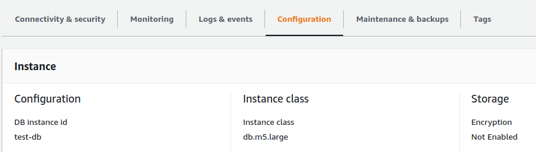
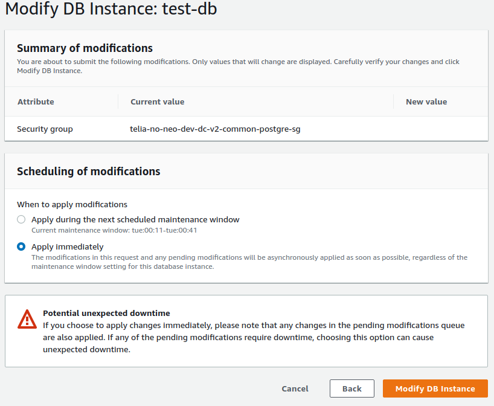
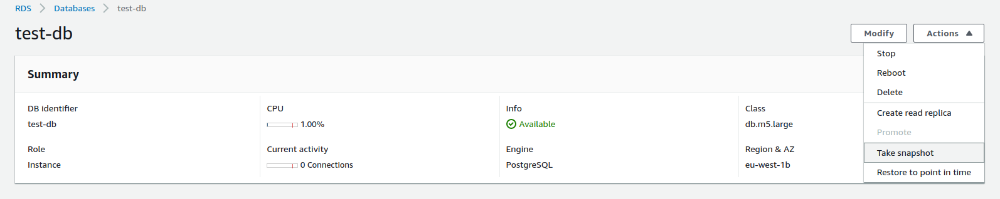
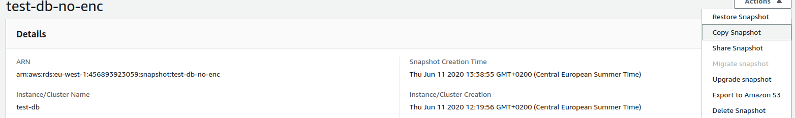
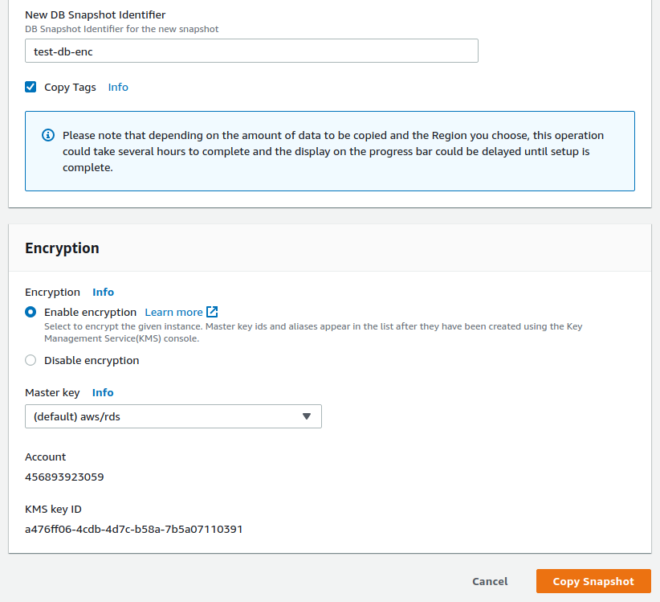
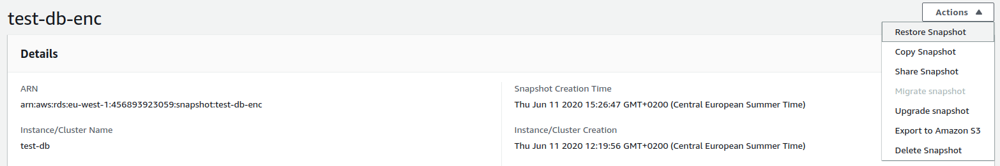
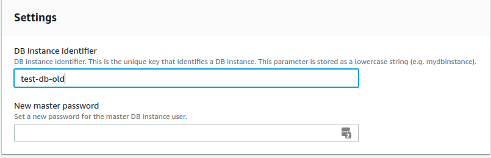
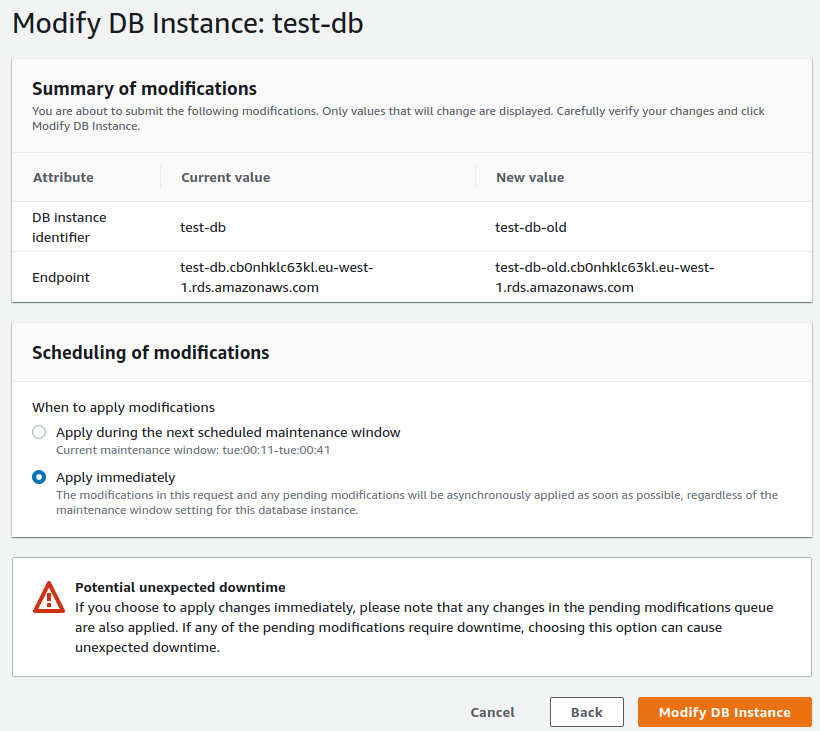
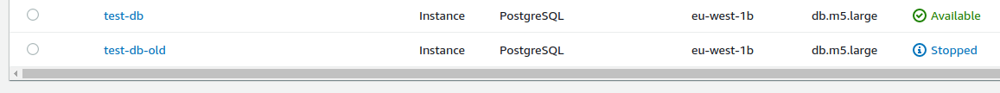
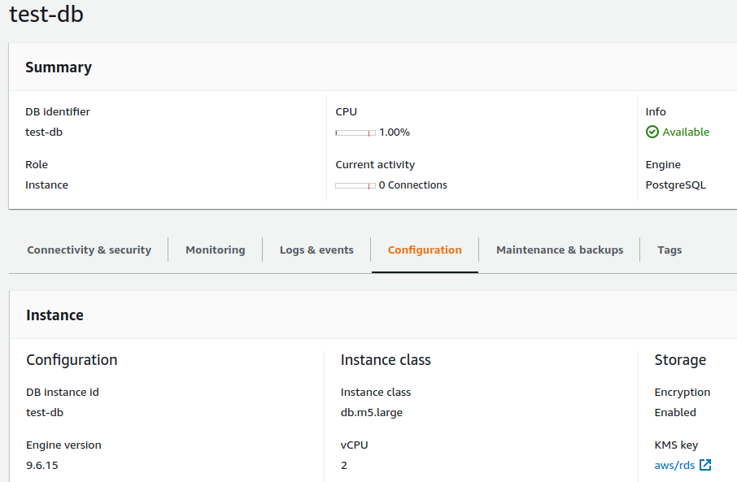

# How to enable encryption on RDS running instance

When you want to enable storage encryption on running AWD RDS instance using AWS Management Console follows steps below. 

### Check storage encryption status
You can check storage encryption status on instance Configuration page in Storage section.

 
### Disable instance modifications
Purpose of this step is to ensure that no data will be modified during encryption enablement. This can be done multiple ways depending on your AWS security policies. For example disabling network access by removing instance security group.

### Take instance snapshot
First create unencrypted snapshot of original instance.

### Copy snapshot
After initial snapshot is created copy this snapshot.

And enable encryption for new snapshot.

### Restore new snapshot
After snapshot copy is created you have encrypted instance data. Next step is to restore new instance from this encrypted snapshot. You have to specify new instance parameters - put the same parameters as used for original instance.

### Rename instances
Now you have two identical instances (except encryption) and you need to use encrypted instance at the same endpoint as original one. First modify DB instance identifier of the original instance. After finished modify encrypted instance - change DB instance identifier to the value of original instance.  
After renaming original instance you can rename encrypted instance to the name of the original instance. This ensures, that no change on DB client side is needed. 

After renaming original instance can be stopped. Now you are running encrypted instance.

### Check DB connection

### Final steps
- check replicas
- check sg
- cleanup backups and monitoring